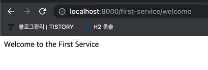

## API Gateway Service
- eureka (discovery-service) server 선실행 후 실행헤야 한다.
- Netty started on port 8080
- tomcat 서버가 아닌 netty 비동기 서버 내에서 실행된다.


### 작동 방법
1. application.yml 설정에서 eureka server url을 설정해준다.
2. application.yml 설정에서 라우팅 설정을 아래와 같이 세팅해준다.
```
server:
  port: 8000

eureka:
  client:
    fetch-registry: false
    register-with-eureka: false
    service-url:
      defaultZone: http://localhost:8761/eureka

spring:
  application:
    name: apigateway-service
  cloud:
    gateway:
      routes:
        - id: first-service
          uri: http://localhost:8081/
          predicates:
            - Path=/first-service/**
        - id: second-service
          uri: http://localhost:8082/
          predicates:
            - Path=/second-service/**

```

- `spring.cloud.gateway` 설정에서 route 설정을 위와 같이 세팅
- `localhost:8081/first-service/**` 로 라우팅된다

3. `eureka server (discovery server)`, `first-service`, `second-service` 애플리케이션을 모두 실행해준다.
4. `api-gateway-service`를 실행하여 `localhost:8080/first-service/welcome` 으로 접속한다.

### 실행 화면
- `localhost:8080/first-service/welcome`을 입력하면 `localhost:8081/first-service/welcome`으로 라우팅된다.

